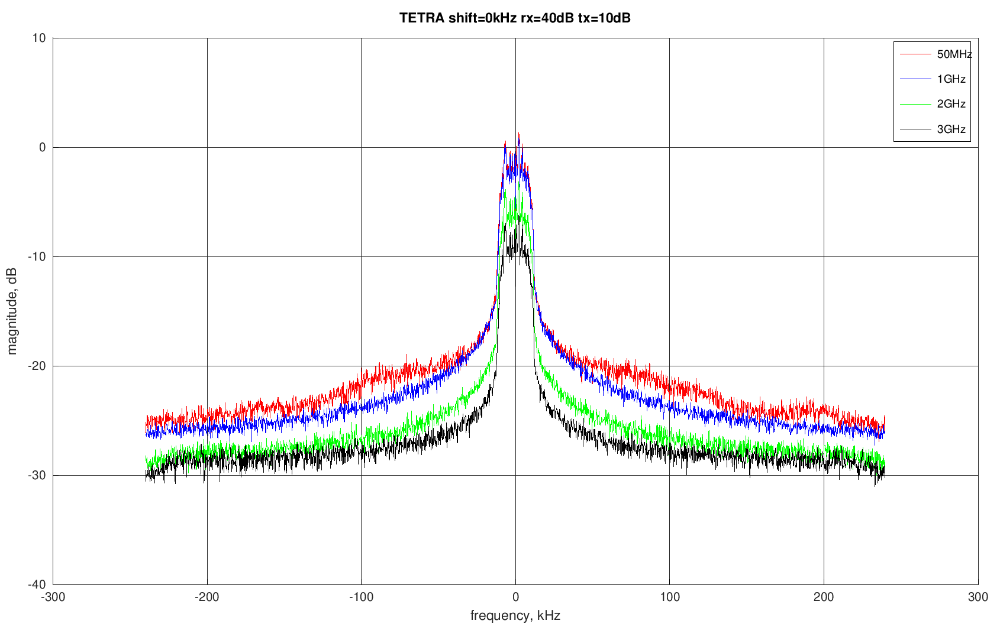
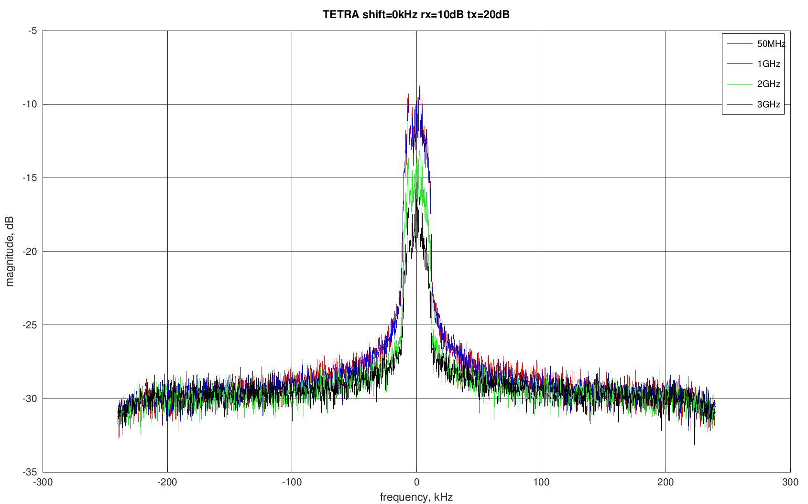
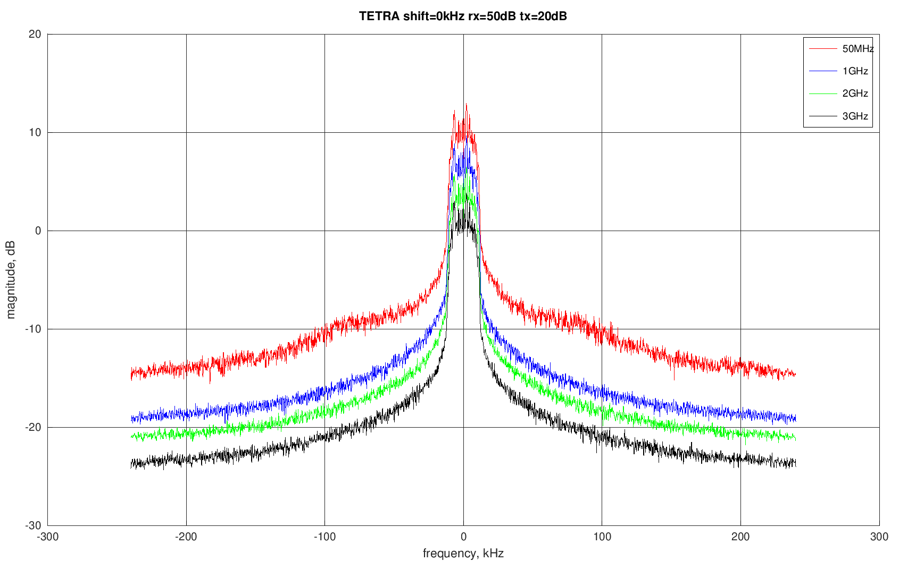
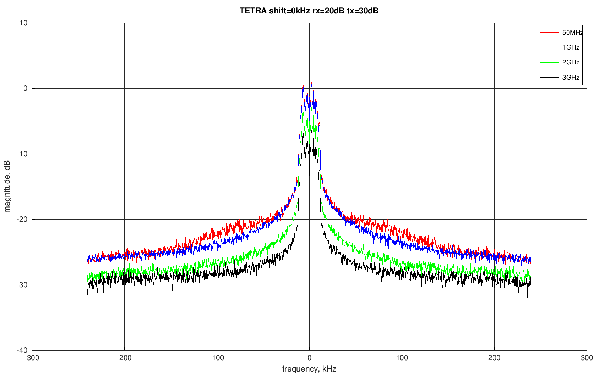
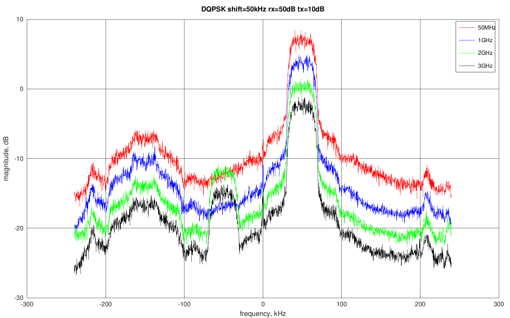
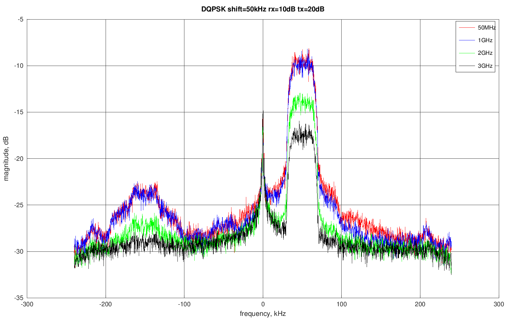
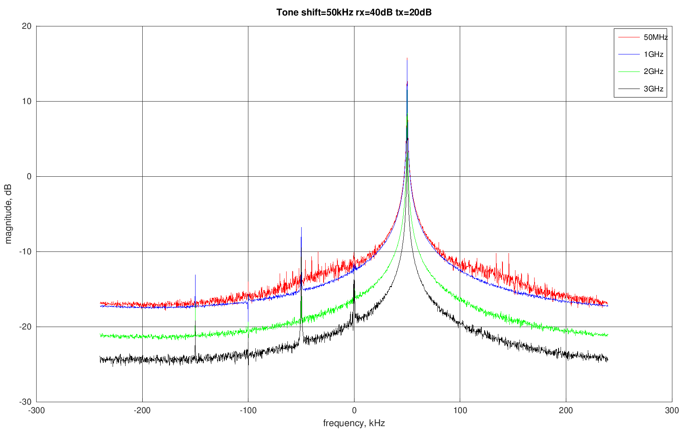
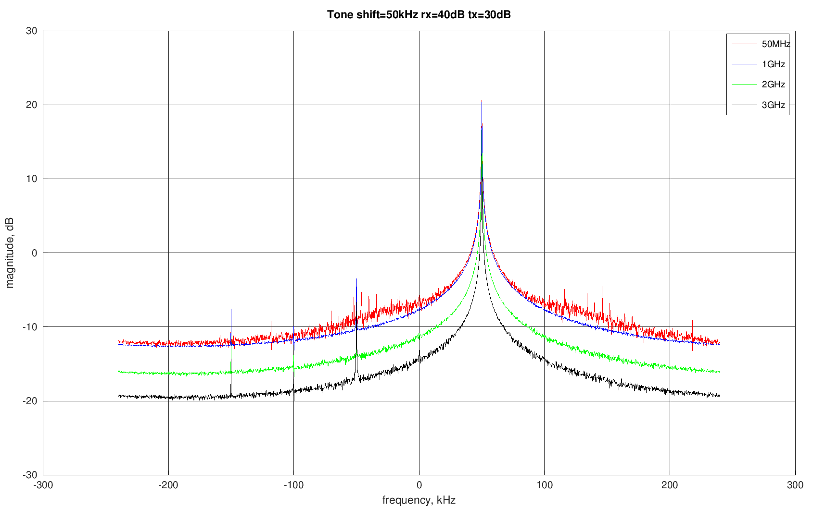

# TETRA

## shift=0kHz

|         | rx=10dB | rx=20dB | rx=30dB | rx=40dB | rx=50dB |
|---------|---------|---------|---------|---------|---------|
| tx=10dB |  |  |  |  |  |
| tx=20dB |  |  |  |  |  |
| tx=30dB |  |  |  |  |  |
| tx=40dB |  |  |  |  |  |
| tx=50dB |  |  |  |  |  |

## shift=50kHz

|         | rx=10dB | rx=20dB | rx=30dB | rx=40dB | rx=50dB |
|---------|---------|---------|---------|---------|---------|
| tx=10dB |  |  |  |  |  |
| tx=20dB |  |  |  |  |  |
| tx=30dB |  |  |  |  |  |
| tx=40dB |  |  |  |  |  |
| tx=50dB |  |  |  |  |  |

# D-QPSK

## shift=0kHz

|         | rx=10dB | rx=20dB | rx=30dB | rx=40dB | rx=50dB |
|---------|---------|---------|---------|---------|---------|
| tx=10dB |  |  |  |  |  |
| tx=20dB |  |  |  |  |  |
| tx=30dB |  |  |  |  |  |
| tx=40dB |  |  |  |  |  |
| tx=50dB |  |  |  |  |  |

## shift=50kHz

|         | rx=10dB | rx=20dB | rx=30dB | rx=40dB | rx=50dB |
|---------|---------|---------|---------|---------|---------|
| tx=10dB |  |  |  |  |  |
| tx=20dB |  |  |  |  |  |
| tx=30dB |  |  |  |  |  |
| tx=40dB |  |  |  |  |  |
| tx=50dB |  |  |  |  |  |

# Tone

## tone=50kHz

|         | rx=10dB | rx=20dB | rx=30dB | rx=40dB | rx=50dB |
|---------|---------|---------|---------|---------|---------|
| tx=10dB |  |  |  |  |  |
| tx=20dB |  |  |  |  |  |
| tx=30dB |  |  |  |  |  |
| tx=40dB |  |  |  |  |  |
| tx=50dB |  |  |  |  |  |

## tone=100kHz

|         | rx=10dB | rx=20dB | rx=30dB | rx=40dB | rx=50dB |
|---------|---------|---------|---------|---------|---------|
| tx=10dB |  |  |  |  |  |
| tx=20dB |  |  |  |  |  |
| tx=30dB |  |  |  |  |  |
| tx=40dB |  |  |  |  |  |
| tx=50dB |  |  |  |  |  |

# Noise

|         | rx=10dB | rx=20dB | rx=30dB | rx=40dB | rx=50dB |
|---------|---------|---------|---------|---------|---------|
| tx=10dB |  |  |  |  |  |
| tx=20dB |  |  |  |  |  |
| tx=30dB |  |  |  |  |  |
| tx=40dB |  |  |  |  |  |
| tx=50dB |  |  |  |  |  |
