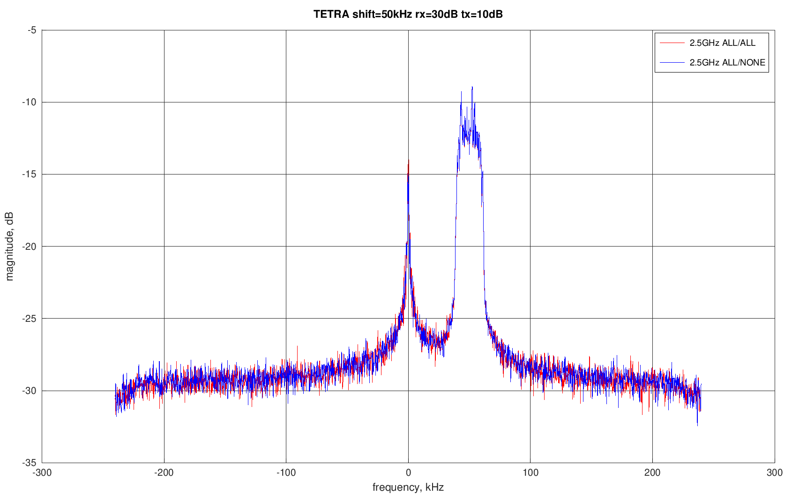
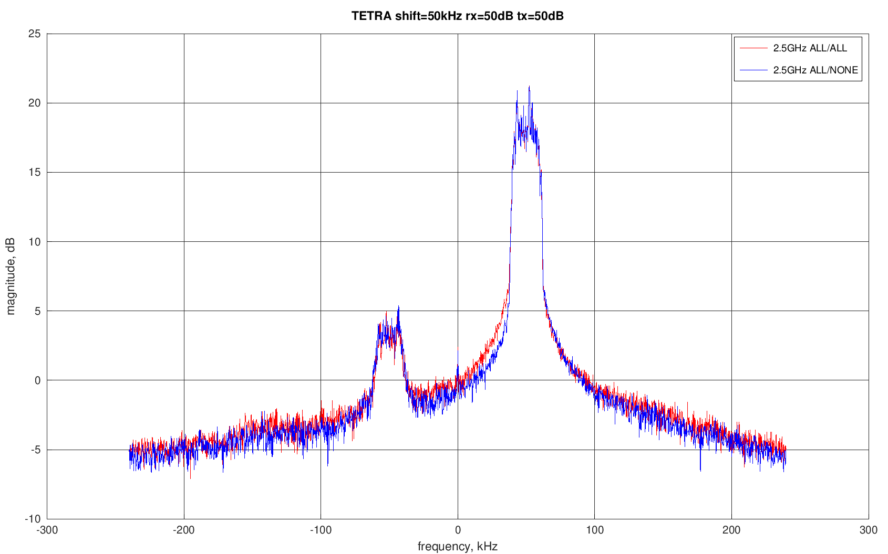
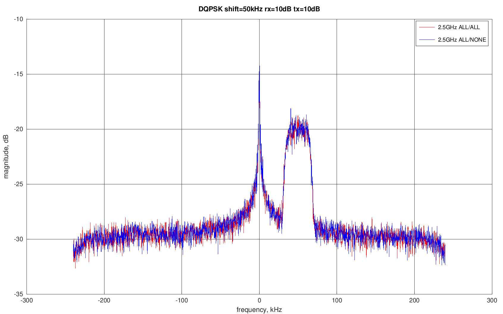
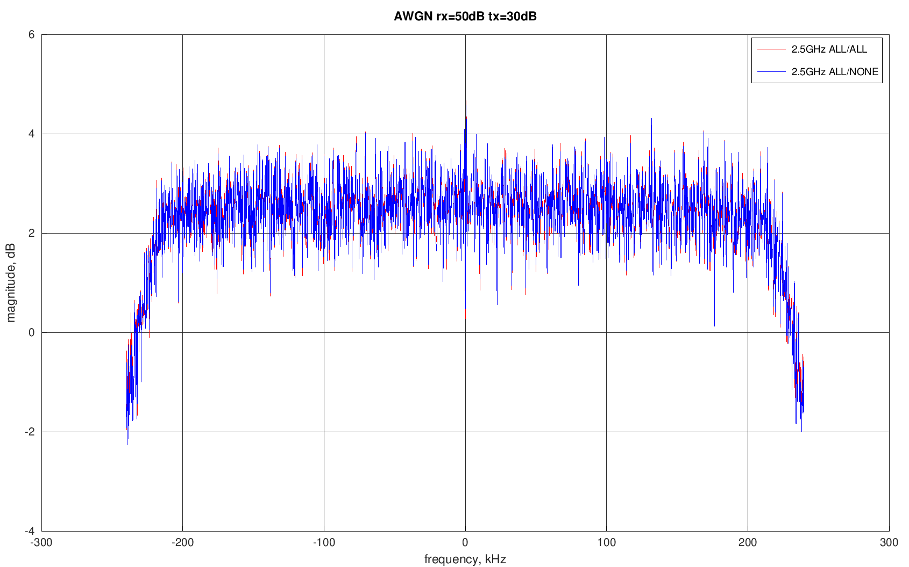

# TETRA

|         | rx=10dB | rx=30dB | rx=50dB |
|---------|---------|---------|---------|
| tx=10dB |  |  |  |
| tx=30dB |  |  |  |
| tx=50dB |  |  |  |

# D-QPSK

|         | rx=10dB | rx=30dB | rx=50dB |
|---------|---------|---------|---------|
| tx=10dB |  |  |  |
| tx=30dB |  |  |  |
| tx=50dB |  |  |  |

# AWGN

|         | rx=10dB | rx=30dB | rx=50dB |
|---------|---------|---------|---------|
| tx=10dB |  |  |  |
| tx=30dB |  |  |  |
| tx=50dB |  |  |  |

# Tone

|         | rx=10dB | rx=30dB | rx=50dB |
|---------|---------|---------|---------|
| tx=10dB |  |  |  |
| tx=30dB |  |  |  |
| tx=50dB |  |  |  |
